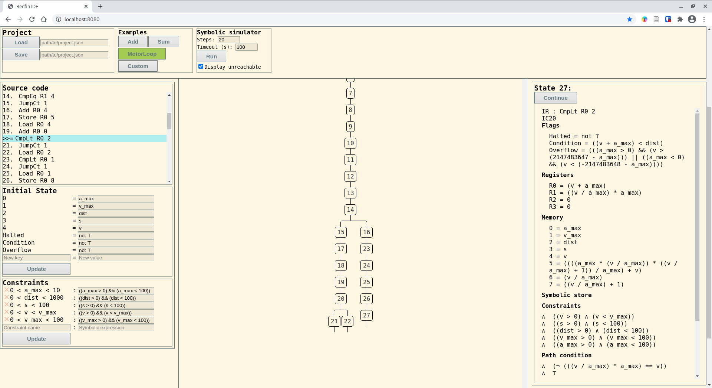

# redfin-ide

A Web UI for symbolically executing and verifying Redfin programs, using [redfin-lib](https://github.com/geo2a/redfin-lib).

Implemented with [concur-replica](https://github.com/pkamenarsky/concur-replica).

.

## Features

* Interactive debugging with symbolic execution: step through any reachable execution path
* Clicking on a state displays its contents, constraints and reachability
* Arbitrary symbolic constraints on the initial state
* Limited support for "projects": saving and loading of the IDE state to disk

## Upcoming

* Interface for verification of a subset of [CTL](https://en.wikipedia.org/wiki/Computation_tree_logic). The backend (redfin-lib) implements it.
